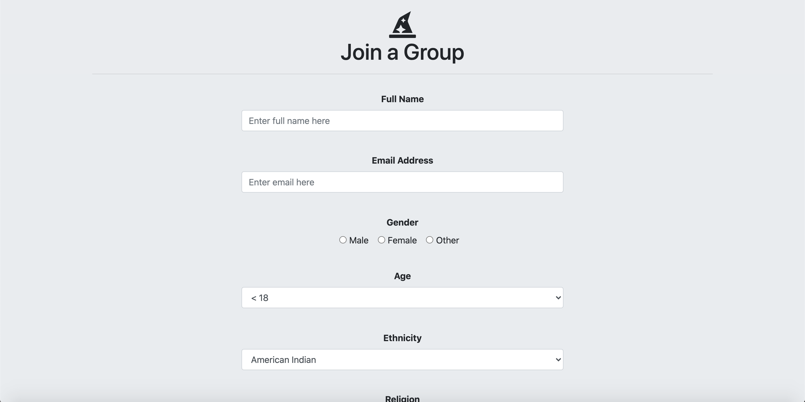

# Microrandom
### Optimizing the randomization process.

Microrandom is an intelligent group generator web application intended to promote diversity in a typically 'random' process. 

It is targeted to be used by teachers and professors in a classroom environment - after registering their class members through a custom link provided to each student, should they wish to conduct a group activity or project for their class, they can simply input the desired grouping details (such as the number of groups) into the app and receive a recommended list of groupings.

The web application is built using Bootstrap, Node and MongoDB, and is hosted here: https://powerful-ocean-44279.herokuapp.com/.

**Features**

* Allows for users to create groups and provide a custom group link from which new members can join.
* Provides a short survey to new members, asking for basic demographic details which are stored securely.
* Utilizes a genetic algorithm to determine optimal groupings that demonstrate the highest degree of diversity.
* Employs secure user and password authentication via Passport.
* Utilizes MongoDB Atlas for cloud database storage and Heroku for hosting.

**Build Instructions for Local Execution**

After cloning the repository, cd into it and install the node modules as:
~~~~
npm install
~~~~~~~~ 

Execute the app via nodemon as:
~~~~
nodemon app.js
~~~~~~~~ 

Launch it in your browser by typing in: http://localhost:8000/.

**App Interface**

